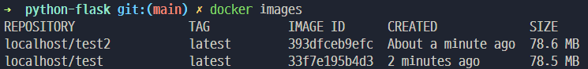
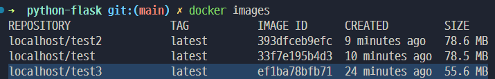

# (IMHO) Dockerfile Best Practices.

- Docker 이미지는 "레이어"의 집합이다
- 이 레이어 시스템을 최대한 활용해야 최고의 Dockerfile이라 할 수 있다

## **그렇다면 좋은 Dockerfile이란?**
1. 일단 작동해야 한다
2. 보안에 안전해야 한다
3. 배포에 빨라야 한다
    1. 빌드가 빨라야 한다
    2. 이미지가 가벼워야 한다
    3. 캐시를 최대한 활용한다
4. 충분히 문서화 되어 있어야 한다

## **그렇게 하려면?**
1. **일단 작동해야 한다**
    - Docker builder에서 이미지를 빌드할때 그 상태는 non-interactive한 상태이다.\
    사용자의 입력을 기다리는 소프트웨어는 빌드 단계에서 절때 사용해서는 안된다
    - ENTRYPOINT에 쉘 코드를 적는 것은 좋다. 하지만 항상 Graceful Shutdown을 생각해야 한다\
    많은 초보자들이 실수하는 내용으로 ENTRYPOINT에 쉘 스크립트를 사용한다면 꼭 시스템이 보내주는 시그널들을 trap 해줘야 한다. 그렇지 않으면 SIGKILL 이 trigger될때까지 기다리는 불상사가 발생한다
2. **보안에 안전해야 한다**
    - Root 유저가 아닌 런타임을 위한 유저를 따로 생성해 사용한다\
    root 유저를 사용하게 된다면 apk 와 같은 패키지 메니저를 사용할 수 있어 위험할 수 있다\
    또한 마운트된 볼륨이 있다면 도커 속 격리된 UID 시스템은 실제 시스템에 자신의 UID로 관여하게 된다\
    -> 즉, 허용하지 않은 권한이 부여될 수 있으며 언제 namespace 시스템이 털릴지 모른다
3. **배포에 빨라야 한다**
    - 미러가 적거나 느린 경우 빌드 단계에서 인터넷을 사용하는 행위를 줄이자\
    때에 따라 작은 빌드 이미지로 빌드에 필요한 패키지를 다운받아 빌드하는 것 보다
    미리 모든 도구가 깔려있는 이미지로 빌드하는 것이 더 효율적일 수 있다
    - Multistage를 활용해 빌드 이후 나오는 이미지는 최대한 작게 유지해야 한다\
    Dockerfile 제작의 가장 초보적인 실수는 런타임때 실제로 사용하지 않는 도구들이 같이 딸려 오는 경우다
    예를 들어 node.js 를 실행시킬때 node 만 있으면 되지 npm은 전혀 필요가 없다. node_modules만 만들어주고 사라지면 된다
    - 오래걸리는 RUN은 맨 위로 보내고 내용 변경이 많은 COPY는 맨 아래로 보낸다\
    Docker는 Dockerfile에서 한줄 한줄 읽어보면서 이미 실행한적이 있는 줄은 그때것을 재활용 하고
    만약 새로운 줄이 나왔거나 COPY 할 대상이 변경되었다면 즉시 그 Stage의 그 줄 이하는 전부 캐싱이 되지 않는다
    - 레이어의 개수는 성능에 크게 의미가 없다. RUN들을 적당히 쪼갤 줄도 알아야 한다.\
    잘게 쪼개진 레이어들이 잘 캐싱되어 재사용이 가능하다면 레이어 개수의 단점을 단번에 상쇄할 수 있다.
    - 레이어의 개수를 줄이라는 말은 쓸때없는 레이어를 만들지 말라는 뜻이다\
    이미지의 용량을 줄이겠다고 이전 레이어에서 설치한 파일을 삭제하는 짓은 의미가 없다. 이미지에는 어짜피 상위 레이어에서 삭제하더라도 하위 레이어가 그대로 유지되기 때문이다.
4. **충분히 문서화 되어 있어야 한다**
    - `cd ...` 보다 WORKDIR를 애용하자. 가독성에 매우 도움이 된다
    - CMD와 ENTRYPOINT를 구분하자\
    ENTRYPOINT는 실행할 바이너리를 지정하는 것이고
    CMD는 그 ENTRYPOINT에 기본값으로 어떤 Argv 들을 줄것인지 지정하는 것이다.

## 하지만
1. 이미지를 만드는데 너무 많은 시간을 쓰지 말자
   * 너무 타이트하게 작성된 Dockerfile은 Application이 변경되었을 때 오작동을 일으키기 쉬워진다
   * Static-linked 바이너리가 아니라면 scratch base image 대신 distro가 있는 것이 좋다\
   그정도의 차이는 사실상 무의미 하며 distro의 package manager의 이점을 챙기지 못한다
2. 과도한 문서화가 성능을 저하시켜선 안된다
   * USER에는 유저명 대신 UID를 적는게 낫다\
   USER에 유저명을 적으면 /etc/passwd에서 유저명을 찾으려고 한다. 만약 없다면 만들어야 하므로 adduser를 하는 하나의 작업이 더 추가될 수 있다.

## 예시
### Python + PIP를 쓸때..
* alpine 이미지를 기반으로 간단한 Dockerfile을 짜보았다
    ```Dockerfile
    FROM alpine

    RUN apk add --no-cache python3 py3-pip
    RUN mkdir /app && \
        chown 1000:1000 /app

    USER 1000:1000
    WORKDIR /app

    COPY . .

    RUN pip install -t .lib -r requirements.txt

    ENV PYTHONPATH=/app/.lib
    ENTRYPOINT ["/usr/bin/python3", "src/app.py"]
    ```

* 여기서 문제점은 무엇일까?
* requirements.txt가 아닌 app.py 같이 다른 소스코드가 바뀌어도 pip를 다시 하려고 시도할 것이다.

    ```Dockerfile
    # (전략)

    # 모든 파일을 복사했다
    COPY . .

    # 위의 COPY 문이 변경되면 pip가 실행될 것이다.
    # requirements.txt가 아닌 일반 소스코드가 변해도 실행되버린다
    RUN pip install -t .lib -r requirements.txt

    ENV PYTHONPATH=/app/.lib
    ENTRYPOINT ["/usr/bin/python3", "src/app.py"]
    ```

* 더 나은 방법은 아래와 같다

    ```Dockerfile
    # (전략)

    # requirements.txt만 미리 복사한다
    COPY requirements.txt .

    # 위 레이어가 캐시되지 못했을 때만 pip가 작동한다
    # 즉 이 예제에서는 requirements.txt가 변경되었을 때만 pip를 할 뿐
    # 라이브러리 리스트가 아닌 어플리케이션 코드만 변경되었을 때는 pip를 다시 하지 않고 캐시를 활용한다
    RUN pip install -t .lib -r requirements.txt

    # 이제 라이브러리를 다 가져왔으니 실질적인 소스 코드를 복사한다
    COPY src/ src/

    ENV PYTHONPATH=/app/.lib
    ENTRYPOINT ["/usr/bin/python3", "src/app.py"]
    ```

* 이 수정한 Dockerfile의 또 다른 문제점은 무엇일까
* 이미지를 실행해보면 알겠지만 런타임에 필요없는 pip 바이너리가 이미지에 존재하는 것을 볼 수 있다.
* pip 는 라이브러리를 다운받고 나서는 런타임에 더이상 필요하지 않으므로 이미지 사이즈 축소와 취약점 방지를 위해 삭제를 해보자
    ```Dockerfile
    # (전략)

    COPY requirements.txt .

    RUN pip install -t .lib -r requirements.txt
    COPY src/ src/

    USER root
    RUN apk del py3-pip

    USER 1000:1000
    ENV PYTHONPATH=/app/.lib
    ENTRYPOINT ["/usr/bin/python3", "src/app.py"]
    ```

* 최종 이미지에서 pip는 없어졌지만 과연 용량이 줄었을까?
    
* 아니다. 도커 이미지는 "레이어"의 집합으로 위 레이어에서 아무리 지워도 아래 레이어에서 추가된 내용은 이미지에 남아있게 된다
* 이 문제를 해결하기 위해선 multi-stage라는 기술을 사용해 새롭게 레이어를 쌓아 나가면 된다.
* multi-stage 기능은 한 Dockerfile에 FROM 문을 여러개 넣어 서로 분리된 별도의 레이어들을 쌓아나가는 방식으로 최종적으로는 맨 아래 있는 FROM 문 부터가 실제 이미지로 실행되게 된다 (옵션으로 설정 가능)
    ```Dockerfile
    # (전략)

    COPY requirements.txt .

    RUN pip install -t .lib -r requirements.txt
    COPY src/ src/

    # 여기서 부터 새로운 레이어를 쌓기 시작한다
    FROM alpine
    RUN apk add --no-cache python3

    USER 1000:1000
    WORKDIR /app

    # --from 옵션을 통해 위에서 했던 작업 결과물을 복사해준다
    COPY --from=0 /app /app

    ENV PYTHONPATH=/app/.lib
    ENTRYPOINT ["/usr/bin/python3", "src/app.py"]
    ```

* 결과는 다음과 같다
    
